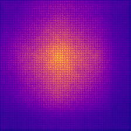
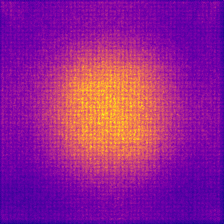
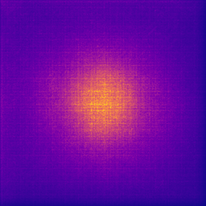
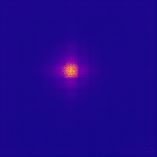
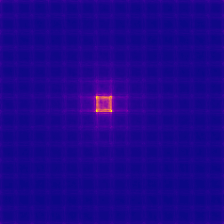
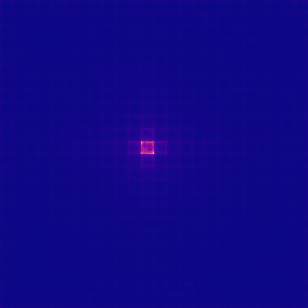

# OpenERF

[](./LICENSE)
[](https://www.python.org/)
[](https://github.com/huggingface/pytorch-image-models)

> One-line **Effective Receptive Field (ERF)** extraction for pretrained `timm` vision models.

ERF visualizes how input pixels contribute to model responses — useful for interpretability and trustworthy AI workflows.

```python
import OpenERF
import timm

model_name = "resnet50.a1_in1k"
model = timm.create_model(model_name, pretrained=True)

OpenERF.save_ERF(model, model_name=model_name)
# -> ./results/OpenERF_resnet50.a1_in1k.png
```

---

## Visual Gallery

All images below are ERF maps generated from the ImageNet validation subset in `./imagenet_val_1000`.
The full set is available in [`./results/`](./results/).

### CNN Families

| ResNet-34 | ResNet-50 | ResNeXt-101 |
| --- | --- | --- |
|  |  |  |
| `resnet34.a1_in1k` | `resnet50.a1_in1k` | `resnext101_32x8d.tv_in1k` |

| DenseNet-201 | EfficientNet-B2 | TF-EfficientNet-B4 |
| --- | --- | --- |
|  |  |  |
| `densenet201.tv_in1k` | `efficientnet_b2.ra_in1k` | `tf_efficientnet_b4.ns_jft_in1k` |

### ViT Families

| ViT-B/16 | DeiT-B/16 | CaiT-S24 |
| --- | --- | --- |
|  |  |  |
| `vit_base_patch16_224.augreg_in1k` | `deit_base_patch16_224.fb_in1k` | `cait_s24_224.fb_dist_in1k` |

| XCiT-Medium | BEiT-B/16 (224) | BEiT-B/16 (384) |
| --- | --- | --- |
|  |  |  |
| `xcit_medium_24_p16_224.fb_in1k` | `beit_base_patch16_224.in22k_ft_in22k_in1k` | `beit_base_patch16_384.in22k_ft_in22k_in1k` |

### Swin Families

| Swin-B | SwinV2-Small | SwinV2-Small-NS |
| --- | --- | --- |
|  |  |  |
| `swin_base_patch4_window7_224.ms_in1k` | `swinv2_cr_small_224.sw_in1k` | `swinv2_cr_small_ns_224.sw_in1k` |

---

## Table of Contents

- [Features](#features)
- [Installation](#installation)
- [Quick Start](#quick-start)
- [CLI Options](#cli-options)
- [Output Structure](#output-structure)
- [API Reference](#api-reference)
- [Supported Models](#supported-models)
- [Dataset](#dataset)
- [Citing](#citing)
- [License](#license)

---

## Features

- **One-line API** — `OpenERF.save_ERF` for end-to-end ERF extraction
- **Automatic preprocessing** — `mean/std`, interpolation, `crop_pct`, input size via `timm`
- **Unified workflow** — CNN and Transformer families with the same interface
- **Publication-ready output** — colored ERF maps (`plasma` colormap by default)
- **Optional exports** — Gaussian fitting (`lmfit`), `.npy` arrays, `.json` metrics

## Installation

```bash
conda activate OpenERF
pip install -r requirements.txt
pip install -e .
```

## Quick Start

### Python API — single model

```python
import OpenERF
import timm

model_name = "resnet50.a1_in1k"
model = timm.create_model(model_name, pretrained=True)

result = OpenERF.save_ERF(
    model=model,
    model_name=model_name,
    image_dir="./imagenet_val_1000",
    max_images=1000,
    colormap="plasma",
    save_numpy=True,
    save_metrics=True,
)

print(result["save_path"])
print(result.get("npy_path"))
print(result.get("metrics_path"))
```

### CLI — batch run (preset models)

```bash
python example.py --image-dir ./imagenet_val_1000 --max-images 1000
```

```bash
# show all preset models
python example.py --list-models

# resume long runs
python example.py --image-dir ./imagenet_val_1000 --max-images 1000 --skip-existing

# run selected families only
python example.py --families vit deit cait xcit beit swin swinv2 \
    --image-dir ./imagenet_val_1000 --max-images 1000
```

## CLI Options

`example.py` supports the following options:

| Option | Description | Default |
| --- | --- | --- |
| `--families` | Model families to run (when `--model-names` is not set) | all preset families |
| `--model-names` | Explicit `timm` model names (must include pretrained tag) | `None` |
| `--image-dir` | Input image directory | `./imagenet_val_1000` |
| `--save-dir` | PNG output directory | `./results` |
| `--npy-dir` | NumPy output directory | `./results_npy` |
| `--metrics-dir` | Metrics output directory | `./results_metrics` |
| `--max-images` | Maximum images to process | `1000` |
| `--target-layer` | Override feature source layer | auto (family preset) |
| `--fit-gaussian` | Enable 2D Gaussian fit (`sigma_x`, `sigma_y`) | disabled |
| `--skip-existing` | Skip if output PNG already exists | disabled |
| `--no-save-numpy` | Disable `.npy` export | enabled |
| `--no-save-metrics` | Disable `.json` export | enabled |
| `--stop-on-error` | Stop immediately on model failure | disabled |

## Output Structure

```
./results/                OpenERF_<model_name>.png          # ERF heatmap
./results_npy/            OpenERF_<model_name>.npy          # ERF array
./results_metrics/        OpenERF_<model_name>_metrics.json # ERF metrics
./results_debug/          (smoke/check/intermediate artifacts)
```

## API Reference

### `OpenERF.compute_ERF(...)`

Computes ERF in memory. Returns `ERFResult`:

| Field | Description |
| --- | --- |
| `erf_map` | 2D ERF array |
| `num_images` | Number of images processed |
| `data_config` | `timm` data config used |
| `resolved_target_layer` | Actual target layer name |
| `gaussian_fit` | *(optional)* Gaussian fit parameters |

### `OpenERF.save_ERF(...)`

Computes ERF, saves PNG, and optionally exports `.npy` / `.json`.

**Defaults:** `save_numpy=False`, `save_metrics=False`, `colormap="plasma"`

| Return key | Description |
| --- | --- |
| `model_name` | Model identifier |
| `source_model_name` | Original `timm` model name |
| `save_path` | Path to saved PNG |
| `num_images` | Number of images processed |
| `target_layer` | Target layer name |
| `family` | Model family |
| `data_config` | `timm` data config used |
| `gaussian_fit` | *(optional)* Gaussian fit result |
| `npy_path` | *(optional)* Path to `.npy` file |
| `metrics_path` | *(optional)* Path to `.json` file |

## Supported Models

11 families &times; 3 variants = **33 preset models**

| Family | Models |
| --- | --- |
| `resnet` | `resnet18.a1_in1k`, `resnet34.a1_in1k`, `resnet50.a1_in1k` |
| `resnext` | `resnext50_32x4d.a1_in1k`, `resnext50_32x4d.ra_in1k`, `resnext101_32x8d.tv_in1k` |
| `densenet` | `densenet121.ra_in1k`, `densenet169.tv_in1k`, `densenet201.tv_in1k` |
| `efficientnet` | `efficientnet_b0.ra_in1k`, `efficientnet_b2.ra_in1k`, `tf_efficientnet_b4.ns_jft_in1k` |
| `vit` | `vit_small_patch16_224.augreg_in1k`, `vit_base_patch16_224.augreg_in1k`, `vit_base_patch32_224.augreg_in1k` |
| `deit` | `deit_tiny_patch16_224.fb_in1k`, `deit_small_patch16_224.fb_in1k`, `deit_base_patch16_224.fb_in1k` |
| `cait` | `cait_xxs24_224.fb_dist_in1k`, `cait_xxs36_224.fb_dist_in1k`, `cait_s24_224.fb_dist_in1k` |
| `xcit` | `xcit_tiny_12_p16_224.fb_in1k`, `xcit_small_12_p16_224.fb_in1k`, `xcit_medium_24_p16_224.fb_in1k` |
| `beit` | `beit_base_patch16_224.in22k_ft_in22k`, `beit_base_patch16_224.in22k_ft_in22k_in1k`, `beit_base_patch16_384.in22k_ft_in22k_in1k` |
| `swin` | `swin_tiny_patch4_window7_224.ms_in1k`, `swin_small_patch4_window7_224.ms_in1k`, `swin_base_patch4_window7_224.ms_in1k` |
| `swinv2` | `swinv2_cr_tiny_ns_224.sw_in1k`, `swinv2_cr_small_224.sw_in1k`, `swinv2_cr_small_ns_224.sw_in1k` |

## Dataset

OpenERF uses the ImageNet validation set (or a subset).

- Default subset index: `./imagenet_val_1000.txt`
- Image folder: `./imagenet_val_1000/`
- Default scope: `--image-dir ./imagenet_val_1000 --max-images 1000`

## Citing

If OpenERF is useful in your research, please cite:

```bibtex
@inproceedings{KimCJK23,
  author       = {Bum Jun Kim and
                  Hyeyeon Choi and
                  Hyeonah Jang and
                  Sang Woo Kim},
  title        = {Understanding Gaussian Attention Bias of Vision Transformers Using
                  Effective Receptive Fields},
  booktitle    = {{BMVC}},
  pages        = {214},
  publisher    = {{BMVA} Press},
  year         = {2023}
}
```

```bibtex
@article{KimCJLJK23,
  author       = {Bum Jun Kim and
                  Hyeyeon Choi and
                  Hyeonah Jang and
                  Dong Gu Lee and
                  Wonseok Jeong and
                  Sang Woo Kim},
  title        = {Dead pixel test using effective receptive field},
  journal      = {Pattern Recognit. Lett.},
  volume       = {167},
  pages        = {149--156},
  year         = {2023}
}
```

## License

This project is released under the [MIT License](./LICENSE).
